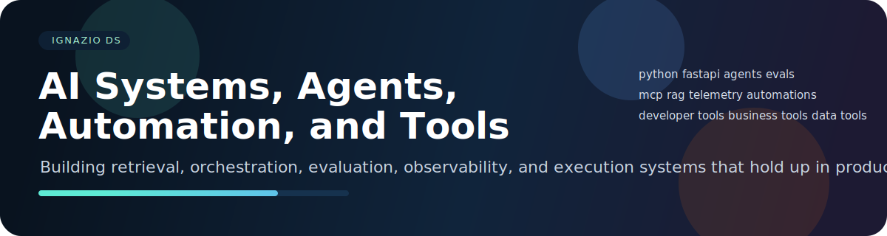

# Ignazio De Santis

If your AI system works in demos but breaks under real usage, you’re not alone. Most RAG pipelines and agent workflows fail because they’re not designed for retrieval quality, state, and failure handling.
I build reliable AI systems: retrieval, agent orchestration, evaluation, and production automation.

Available for contract work.
[Website](https://ignaziodesantis.com/) · [LinkedIn](https://www.linkedin.com/in/ignaziodesantis) · [Email](mailto:ignazio.desantis.dev@gmail.com)

---

### Flagship systems
| Project | What it does |
|---------|--------------|
| **SentinelID** | Passkey-style face authentication system — on-device CV for identity verification, liveness detection, and anti-spoofing. Desktop app (Tauri/Rust) + web dashboard (Next.js + FastAPI). |
| **NexusRAG** | Multi-provider RAG platform with pluggable backends across cloud AI services. Supports multi-modal output (text + synthesized speech). |
| **Agent Runbook Orchestrator** | Durable execution layer for AI-assisted operational workflows — step graphs with approval gates, retry logic, state persistence, and audit history. |

---

### AI & Agents
| Repo | Description |
|------|-------------|
| evalops-workbench | Local-first evaluation harness for prompts, tools, and agents with regression tracking |
| repo-rag-debugger | Source-aware debugging assistant that indexes codebases and docs to propose grounded fixes |
| spec-to-agent-scaffold | Generates typed Python agent service skeletons from structured product specs |

### Data & Analytics
| Repo | Description |
|------|-------------|
| data-quality-watchtower | Schema drift detection, anomaly monitoring, and dataset validation before pipelines break |
| notebook-pipeline-converter | Converts exploratory notebooks into repeatable, testable batch pipelines |
| api-sync-pipeline | Incremental REST API to SQLite sync engine — cursor pagination, retry/backoff, YAML config |
| marketing-attribution | Multi-touch attribution analysis: last-click vs linear vs time-decay across 17k touchpoints |
| churn-analysis | SaaS customer churn cohort analysis — onboarding signals, channel quality, retention heatmaps |

### Business Automation
| Repo | Description |
|------|-------------|
| revenue-signal-copilot | Lead intelligence and prioritization using public signals and internal notes |
| customer-ops-briefing-bot | Weekly account intelligence agent from CRM activity, meeting notes, and support history |
| lead-aggregator | Multi-feed RSS lead aggregator with keyword scoring, deduplication, and CSV/SQLite export |
| price-monitor | Multi-site e-commerce price monitoring with threshold alerts and CSV reporting |
